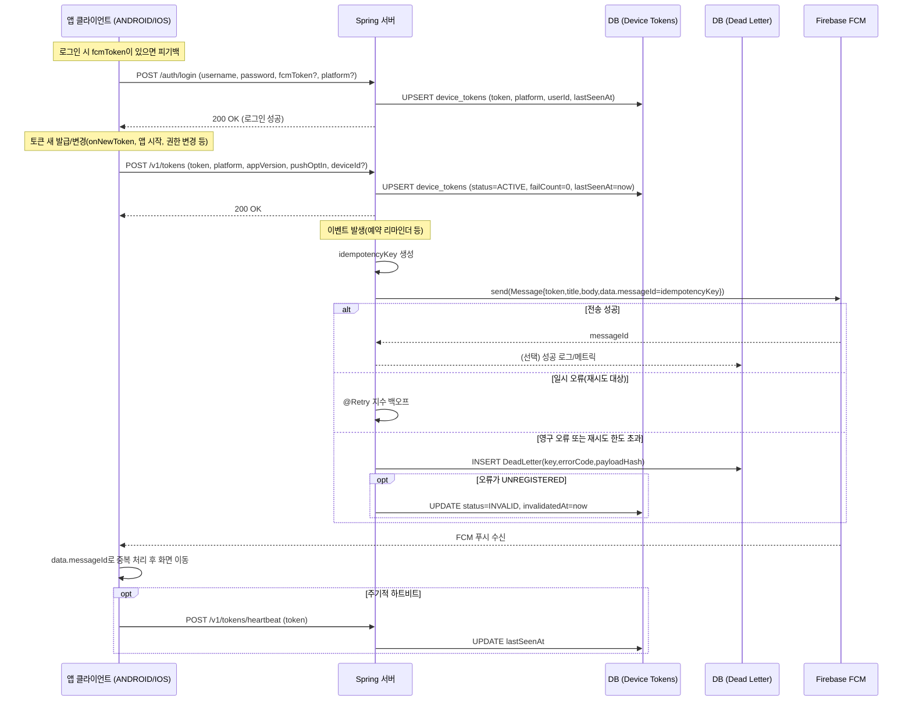

## 푸시 알림 아키텍처

FCM 푸시 전송에서 발생 가능한 예외에 따라 Spring의 @Retry 및 @Recover 기능을 활용하여 푸시 전송을 재시도 및 복구 처리한다.
푸시 전송 실패 내역을 FailAlarmNotificationLog 테이블에 저장하여 추후 모니터링 및 재처리가 가능하게끔 한다.

### 엔티티 설계

- DeviceFcmToken 엔티티
  - 하나의 사용자는 여러 디바이스를 사용할 수 있다. 
  - 각 기기별로 푸시 동의 여부가 다를 수 있다.
  - 각 기기와 FcmToken은 1 : 1 매칭이나 FcmToken은 갱신될 수 있다.
- FailNotificationLog 엔티티
  - MessagingErrorCode를 저장한다. (실패 이유)
  - 재처리 시 성공 실패 여부를 저장한다.
  - 재처리 횟수를 저장한다.

### MessagingErrorCode

- `INTERNAL` : FCM 서버 오류 / 일시 장애 → 재시도
- `UNAVAILABLE` : FCM 서비스 일시 불가 → 재시도
- `QUOTA_EXCEEDED` : 전송 한도 초과 → 재시도 (긴 백오프, 스로틀링)
- `INVALID_ARGUMENT` : 잘못된 토큰 포맷 -> 실패 로그 적재
- `THIRD_PARTY_AUTH_ERROR` : APNs/인증키 문제 -> 실패 로그 적재
- `SENDER_ID_MISMATCH` : 토큰의 프로젝트와 발신자 불일치 → 실패 로그 적재
- `UNREGISTERED` : 앱 인스턴스가 FCM에서 등록 해제 → `INVALID`

## Retry 및 Recover Code

```java

@Retryable(
            value = RetryableAlarmException.class,
            maxAttempts = 4,
            backoff = @Backoff(delay = 5000, multiplier = 2.0, maxDelay = 900000)
    )
    public void sendMessage(DeviceFcmToken deviceFcmToken, Message message) {
        try {
            String response = FirebaseMessaging.getInstance().send(message);
            log.info("Send Notification Success: {}", response);
        } catch (FirebaseMessagingException e) {
            MessagingErrorCode code = e.getMessagingErrorCode();
            switch (code) {
                case INTERNAL, UNAVAILABLE, QUOTA_EXCEEDED -> {
                    throw new RetryableAlarmException(code);
                }
                case UNREGISTERED -> {
                    recordFailNotification(deviceFcmToken, message, code);
                }
                default -> recordFailNotification(deviceFcmToken, message, code);
            }
            log.error("메시지 전송 실패 : {}", e.getMessagingErrorCode().name());
        }
    }

    @Recover
    @Transactional(propagation = Propagation.REQUIRES_NEW)
    public void recover(
            RetryableAlarmException ex,
            DeviceFcmToken deviceFcmToken, Message message) {
        recordFailNotification(deviceFcmToken, message, ex.getCode());
    }

    private void recordFailNotification(DeviceFcmToken deviceFcmToken, Message message, MessagingErrorCode code) {
        try {
            deviceFcmToken.markInvalid();
            FailNotificationLog failLog = FailNotificationLog.record(
                    deviceFcmToken.getId(), mapper.writeValueAsString(message), code);
            failNotificationLogRepository.save(failLog);
            log.info("Fail Notification Log 기록 성공: {}", failLog);
        } catch (Exception e) {
            log.error("Fail Notification Log 기록 실패 : {}", e.getMessage());
        }
    }

```


